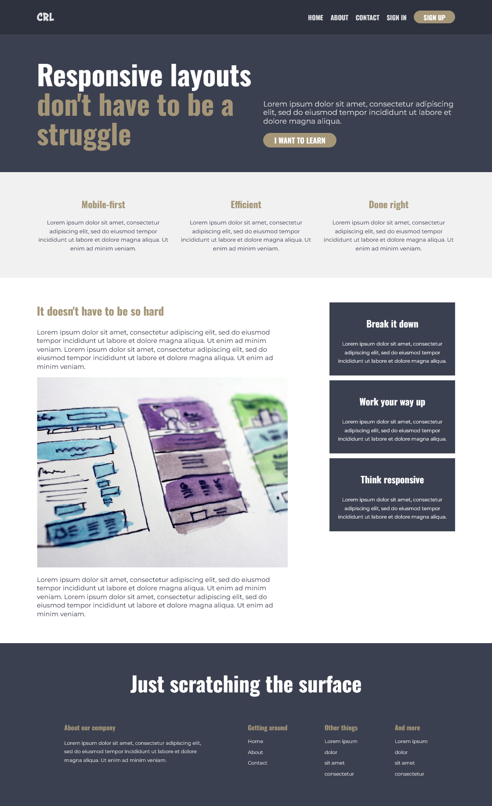

# My Code and Notes for Kevin Powell's Course 'Conquering Responsive Layouts'

## Em vs. Rem

- `ems` compound. So, if the `root` font size is 16px and then a `footer` element is set to `font-size: 2em` and then a `div` within that `footer` is set to `font-size: 2rem` then the font-size within that nested `div` will be 16 x 2 x 2 = 64 pixels.
- `em` is relative to the `font-size` of the parent (or more distant relative, if not `font-size` is specified, and ultimately to the `root`).
- `rem` is always relative to the `root` ('root element').
- If font sizes and other sizes are in `rems`, then we can just change the `font-size` in a media query to shrink everything at different screen sizes.
- Setting paddings for buttons (for e.g.) in `ems` makes sense, because then if we make a smaller or larger button by changing the font-size, the padding will scale along with that font-size change - as opposed to if we set the padding in `rems`, then the padding would remain the same, even if the font-size shrunk or grew. So, this allows for responsive buttons.
- Paddings and margins and things could be set using `ems`, so that they become more responsive, because they will change relative to the `font-size` that is set on their element. So, when `ems` are used for font-sizes, they refer to and compound the font-size one-level up, but when they are set on things like padding, they refer to the font-size of their own element.

## Final Project

The code for this can be found in the directory 'final-challenge'. Here are screen-shots for the three screen sizes targeted: viz. mobile (at 320px), tablet (at about 800px), and desktop (from 1000px up).

